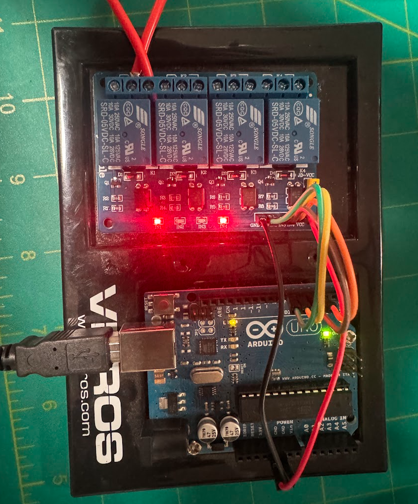

# nano-usbpower

USB-serial control of a 4-channel relay board from an Arduino. Plug the board
into a USB port, open a serial terminal, and switch each relay on/off, run
timed pulses, power-cycle a load, and review a rolling log of every switching
event -- all from a simple text prompt.



## Hardware

| Part | Notes |
| --- | --- |
| **Arduino Uno R3** | ATmega328P. Genuine Uno enumerates as `/dev/ttyACM0` (native USB via ATmega16u2). An Arduino Nano v3 also works -- clones with a CH340 chip come up as `/dev/ttyUSB0` instead. |
| **SunFounder Lab 4 Relay Module, 5V 4 Channels** | Compatible with Arduino R3 / 1280 / Arm / PIC / AVR / STM32. Songle SRD-05VDC-SL-C relays, 10A 250VAC / 10A 30VDC contacts, opto-isolated, **active-low** inputs. Sold by the SunFounder Store. |

The sketch is written for this relay module's active-low inputs
(`RELAY_ACTIVE_LOW` in the config block); set it to `false` for an active-high
board.

## Wiring

Default pin mapping (`PIN_LIST[]` in the sketch):

| Arduino | Relay module |
| --- | --- |
| D4 | IN1 |
| D5 | IN2 |
| D6 | IN3 |
| D7 | IN4 |
| 5V | VCC |
| GND | GND |

Change `PIN_LIST[]` to use any subset of D2--D13 or A0--A5. D0/D1 are the USB
serial lines and are never managed.

**JD-VCC jumper:** these modules ship with a jumper tying the relay coil
supply (`JD-VCC`) to the logic supply (`VCC`). That's fine for bench testing,
but switching a coil draws a current spike on the shared 5V rail. If you see
serial corruption that correlates with relay switching, pull the jumper and
feed `JD-VCC` from its own 5V supply, keeping GND common between the two.

## Build and flash

Using [arduino-cli](https://arduino.github.io/arduino-cli/):

```sh
# Arduino Uno
arduino-cli compile --fqbn arduino:avr:uno usb_crtl_power_x4
arduino-cli upload -p /dev/ttyACM0 --fqbn arduino:avr:uno usb_crtl_power_x4

# Arduino Nano v3 (older bootloader; drop ':cpu=atmega328old' for newer ones)
arduino-cli compile --fqbn arduino:avr:nano:cpu=atmega328old usb_crtl_power_x4
arduino-cli upload -p /dev/ttyUSB0 --fqbn arduino:avr:nano:cpu=atmega328old usb_crtl_power_x4
```

Close any serial terminal before uploading -- `avrdude` needs exclusive access
to the port to reset the board into its bootloader.

## Connecting

115200 baud, 8N1. For example:

```sh
picocom -b 115200 --omap crlf /dev/ttyACM0
```

The firmware accepts **CR, LF, or CRLF** as a line terminator, so it works with
any terminal regardless of its line-ending convention. (`--omap crlf` above is
only there so picocom echoes your own typing readably; picocom sends a bare CR
by default, which the firmware handles fine.)

If a partial or garbled line ever gets stuck waiting for a terminator, press
**Ctrl-C** (or Ctrl-U) to clear the line buffer. A stuck line also clears
itself after 3 seconds of silence (`LINE_IDLE_TIMEOUT_MS`).

Only one program can hold the serial port at a time. If the REST API service
is running it owns the port -- stop it first with
`sudo systemctl stop usbpower-api`.

## Commands

```
help | ?              list commands
config                show current configuration + free RAM
pins                  list managed pins and their live state
status [pin|all]      status of one pin, or all pins (default: all)
on <pin> [tsec]       turn pin ON; if tsec given, auto-OFF after tsec seconds
off <pin>             turn pin OFF, cancels any pending timer
set on|off            turn ALL managed pins ON or OFF
set <pin> on|off      turn one pin ON or OFF (no timer)
toggle <pin>          flip a pin's current state
cycle <pin> [tsec]    power-cycle: pin OFF for tsec seconds, then ON
dump                  dump the entire event log
dump <N>              dump the last N log entries
dump <pin>            dump all log entries for one pin
log clear             erase the event log
reset                 turn all managed pins OFF, cancel all timers
```

Pin tokens: `d4`, `D4`, `4`, or `a0`..`a5`.

Examples:

```
on d4              # relay 1 on
on d4 30           # relay 1 on, auto-off after 30s
cycle d5 10        # relay 2 off for 10s, then back on
status             # state and uptime of every relay
dump 20            # last 20 switching events
```

Every ON/OFF transition is recorded in a 100-entry ring buffer (timestamp,
pin, event, duration in the previous state). The log lives in RAM and is
cleared on reset; adjust `LOG_SIZE` in the config block to trade log depth
against the ATmega328P's 2 KB of SRAM.

## REST API service

`service/usbpower_api.py` exposes the serial command set over HTTP as JSON.
It needs only python3 and pyserial -- no web framework.

### Install

```sh
sudo apt install python3-serial          # if not already present

# 1. Give the board a stable device name (edit the serial number first --
#    find yours with: udevadm info -a -n /dev/ttyACM0 | grep serial)
sudo cp udev/99-usbpower-symlink.rules /etc/udev/rules.d/
sudo udevadm control --reload-rules && sudo udevadm trigger
ls -l /dev/usbpower                      # -> ttyACM0

# 2. Install the service (defaults to /dev/usbpower)
sudo ./service/install.sh
```

> **Do step 1.** `/dev/ttyACM0` is assigned in plug order and is shared with
> every other USB-CDC device -- including Pixhawk/PX4 flight controllers. A
> service pointed at a bare `ttyACM0` can end up opening the wrong board,
> holding it open exclusively, and writing relay commands into it. See
> [Coexisting with other USB serial devices](#coexisting-with-other-usb-serial-devices).

The installer copies the service to `/opt/usbpower-api`, writes a systemd unit
to `/etc/systemd/system/usbpower-api.service`, adds your user to the `dialout`
group if needed, then enables and starts it. Options:

```sh
sudo ./service/install.sh --port /dev/ttyUSB0 \
                          --listen-port 9090 \
                          --host 127.0.0.1 \
                          --user someuser
```

Check on it, and remove it, with:

```sh
systemctl status usbpower-api
journalctl -u usbpower-api -f
sudo ./service/uninstall.sh
```

**The serial port is exclusive.** While the service runs it holds the port
open, so picocom / GTKTerm / the Arduino Serial Monitor cannot use it, and
uploads will fail. Stop the service first: `sudo systemctl stop usbpower-api`.

**Port conflicts.** The API listens on **9090** by default. TCP ports are
exclusive, so whichever program binds first wins and the other is refused;
there is no silent sharing or traffic stealing. If something else already
holds the port, this service exits immediately with a clear message and does
**not** retry (exit code 78, `RestartPreventExitStatus`), because retrying
cannot fix a config problem. It claims the HTTP port before opening the serial
port, so a conflict never resets the board.

Note that 9090 is also the default for Cockpit and Prometheus -- if you run
either, pick a different port. Check what is holding one, then reinstall:

```sh
ss -tlnp | grep :9090
sudo ./service/install.sh --listen-port 9099
```

**Security.** The API binds to `127.0.0.1` and has no authentication. It
switches physical relays that may control mains-voltage loads -- if you bind it
to a routable address, put it behind a reverse proxy with TLS and auth, or
firewall the port.

### Endpoints

| Method | Path | Device command |
| --- | --- | --- |
| GET | `/api/health` | -- (service and link health) |
| GET | `/api/help` | `help` |
| GET | `/api/config` | `config` |
| GET | `/api/status`, `/api/pins` | `status` |
| GET | `/api/pins/<pin>` | `status <pin>` |
| POST | `/api/pins/on` | `set on` |
| POST | `/api/pins/off` | `set off` |
| POST | `/api/pins/<pin>/on` | `on <pin> [seconds]` |
| POST | `/api/pins/<pin>/off` | `off <pin>` |
| POST | `/api/pins/<pin>/toggle` | `toggle <pin>` |
| POST | `/api/pins/<pin>/cycle` | `cycle <pin> [seconds]` |
| GET | `/api/log`, `?limit=N`, `?pin=d4` | `dump` / `dump N` / `dump <pin>` |
| DELETE | `/api/log` | `log clear` |
| GET | `/api/events` | -- (timer expiries the device reported on its own) |
| POST | `/api/reset` | `reset` |
| POST | `/api/raw` | any command, `{"command": "..."}` |

`on` and `cycle` take an optional `{"seconds": N}` JSON body for the auto-off
delay and the off-time respectively.

### Usage

```sh
# read state
curl -s localhost:9090/api/status | jq

# relay 1 on, auto-off after 30s
curl -s -X POST localhost:9090/api/pins/d4/on \
     -H 'Content-Type: application/json' -d '{"seconds": 30}' | jq

# power-cycle relay 2: off for 10s, then back on
curl -s -X POST localhost:9090/api/pins/d5/cycle \
     -H 'Content-Type: application/json' -d '{"seconds": 10}' | jq

# last 20 switching events
curl -s 'localhost:9090/api/log?limit=20' | jq

# everything off
curl -s -X POST localhost:9090/api/reset | jq
```

Replies carry both the parsed result and the device's raw output:

```json
{
  "ok": true,
  "command": "on d4 30",
  "raw": ["D4 -> ON", "auto-OFF in 30s"],
  "changes": [{"pin": "D4", "state": "ON", "changed": true}]
}
```

`changed` is `false` when the pin was already in the requested state (the
device replies `D4 already ON`). A rejected command returns HTTP 400 with the
device's `ERR:` line in `error`; if the board cannot be reached the service
returns HTTP 503.

### Example walkthrough

`examples/api_demo.sh` exercises every endpoint in turn -- reads, single-pin
and all-pin switching, timed pulses, power-cycling, the event log, raw
passthrough, and input validation -- and reports a pass/fail tally:

```sh
./examples/api_demo.sh                          # defaults to localhost:9090
./examples/api_demo.sh http://otherhost:9090
```

It physically switches all four relays, so don't run it against a board
driving a load you care about. It returns everything to OFF at the end.

## Coexisting with other USB serial devices

If you also use a Pixhawk / PX4 / ArduPilot flight controller, a 3D printer
board, a SiK telemetry radio, or any other USB serial hardware on the same
machine, read this.

**The problem.** `/dev/ttyACM0` and `/dev/ttyUSB0` are not device identities --
they are handed out in the order devices are plugged in. An Arduino Uno is a
USB-CDC device and so is a Pixhawk, so they compete for the same `ttyACM*`
names. Unplug and replug something, reboot in a different order, or use a
different USB port, and the numbers move.

**Why that is worse for a service than for a person.** A terminal you open by
hand fails obviously if it lands on the wrong board. This API service starts
automatically at boot, opens its configured port immediately, holds it open
*exclusively*, and writes commands to it. Pointed at a bare `ttyACM0` it can:

- claim your flight controller's port, so QGroundControl or MAVProxy get
  "port busy" or "device not found";
- write `status`, `help`, ... into a MAVLink stream;
- reset the board, because opening a CDC port toggles DTR.

**The fix.** Address the board by its unique USB serial number instead of a
numbered node. `udev/99-usbpower-symlink.rules` creates `/dev/usbpower`, which
always points at this specific Arduino, and the service defaults to it. Two
devices can then never trade places.

```sh
udevadm info -a -n /dev/ttyACM0 | grep -E 'idVendor|idProduct|serial'
```

Put those values in the rule (it ships with this project's board pre-filled),
install it, and confirm:

```sh
sudo cp udev/99-usbpower-symlink.rules /etc/udev/rules.d/
sudo udevadm control --reload-rules && sudo udevadm trigger
ls -l /dev/usbpower
```

CH340-based Nano clones often share a single serial number across all units,
so they cannot be told apart that way; pin those to a physical USB port with
`KERNELS=="1-2.4.1"` instead. The rule file documents both approaches.

Linux also maintains `/dev/serial/by-id/` automatically, which works just as
well if you would rather not add a rule:

```sh
sudo ./service/install.sh --port /dev/serial/by-id/usb-Arduino__www.arduino.cc__0043_XXXXXXXX-if00
```

**What is *not* affected.** The relay board draws its own power and its
switching is electrically isolated from the USB bus, so it does not disturb
other USB devices' data. The hub autosuspend rule below only relaxes power
management on hubs, which if anything makes other devices on that hub more
responsive, and does not change how any device is named or addressed.

## Repository layout

```
usb_crtl_power_x4/    Arduino sketch (the firmware)
service/              REST API service, systemd unit, install/uninstall scripts
examples/             api_demo.sh -- walkthrough of every API endpoint
udev/                 99-usbpower-symlink.rules        stable /dev/usbpower name
                      99-usb-hub-autosuspend-off.rules dropout fix
```

## Troubleshooting

Intermittent silence -- a command sends but no reply comes back, then
communication resumes on its own -- is usually **USB hub autosuspend**, not
the firmware. See [`udev/README.md`](udev/README.md) for the diagnosis and a
persistent fix. Boards plugged directly into a motherboard port are not
affected.
